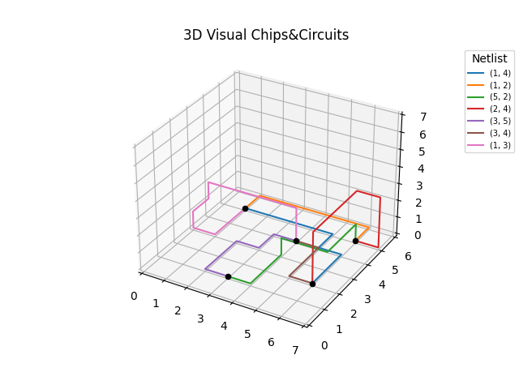

# Chiptuners

Jasper Timmer, Rick Cornelisse, Ariella Hiele

## Case: Chips and Circuits

### Introductie
Onze case gaat over het werkend krijgen van een chip, door onderdelen van deze chip (gates) op de juiste manier met elkaar te verbinden. Het uiteindelijke doel van onze case is om dit zo goedkoop mogelijk te doen. De chip in kwestie is drie-dimensionaal en bevat 8 lagen. Wij hebben aangenomen dat alle gates op de onderste laag liggen. De juiste volgorde waarin gates met elkaar verbonden moeten worden, wordt een netlist genoemd. Enkele voorbeelden hiervan zijn te vinden in de map "data". Het rooster waarbinnen draad wordt aangelegd, wordt vanaf nu de "grid" genoemd.

De case kent ook enkele constraints; zo mogen stukken draad niet over hetzelfde segment binnen de grid lopen (een "collisie"). Ze mogen elkaar wel kruisen (een "intersectie"), dit kost alleen wel meer geld, zoals in de onderstaande kostenformule te zien is.

De kostenfunctie: TK = aantal segmenten + 300 * aantal intersecties

> Ook hebben wij de grootte van de state-space van onze case als volgt berekent:
>
> 2^ N
>
> N = l * [m(n - 1) + n(m - 1)] + mn(l − 1)
>
> N =  totale aantal segmenten
>
> l = aantal lagen
>
> m = breedte grid
>
> n = lengte grid




### Usage
```bash
python main.py netlistnummer (-h) (-c naam algoritme) (-i naam algoritme) (-vis) (-leg) (-n N) (-m N verbeteringen) (-file bestandsnaam)
```
In de commandline is het mogelijk om verschillende functies aan te roepen:

| functies               | beschrijving                                                        |
| :--------------------- | :------------------------------------------------------------------ |
| `-h` of `--help`       | laat informatie zien over de positionele en optionele argumenten.   |
| `-c`                   | kiest algoritme om te gebruiken, opties: baseline, a_star.          |
| `-i`                   | kiest iteratief algoritme, keuze uit: hillclimber of simulated_annealing.                           |
| `-sort_c`              | kiest sorteermethode voor basis algoritme, keuze uit: random, length_a, length_d, middle, outside, gate_a, gate_d, intersections_a, intersections_d. Wanneer er geen methode is gekozen wordt automatisch lengte oplopend gekozen. Wanneer er geen vologrde is gekozen, wordt er automatisch gekozen voor oplopend. |
| `-sort_i`              | kiest sorteermethode voor iteratief algoritme, keuze uit bovenstaande. Wanneer er geen methode is gekozen wordt automatisch lengte oplopend gekozen. Wanneer er geen vologrde is gekozen, wordt er automatisch gekozen voor oplopend. |
| `-vis` of `--visualize`| plot een 3D visualizatie van een oplossing.                         |
| `-leg`of `--legend`    | geeft een legenda bij de 3D visualisatie                            |
| `-n`                   | hoeveel oplossingen moeten er worden gegenereerd?                   |
| `-m`                   | hoeveel verbeterde oplossingen moeten er zijn voor elke oplossing?  |
| `-file`                   | wanneer een al bestaand bestand gebruikt moet worden, voorbeeld: wanneer de bestandsnaam "paths_netlist_4_C_19655" is, gebruik dan "C_19655". |

Om de gegenereerde output op de juiste plek te krijgen is het eerst nodig om bepaalde mappen aan te maken:

```bash
mkdir output
```
```bash
cd output
```
```bash
mkdir results_annealing
```
```bash
mkdir results_hillclimber
```
```bash
mkdir figs
```
### Structuur
- data/ - 

- code/ -

    - algorithms/ -
    - classes/ - 
    - visualize.py

### Requirements
Om het programma werkend te laten draaien, zullen enkele dingen geïnstalleerd moeten zijn. Deze kun je automatisch installeren door: 

```bash
pip install -r requirements.txt
```
